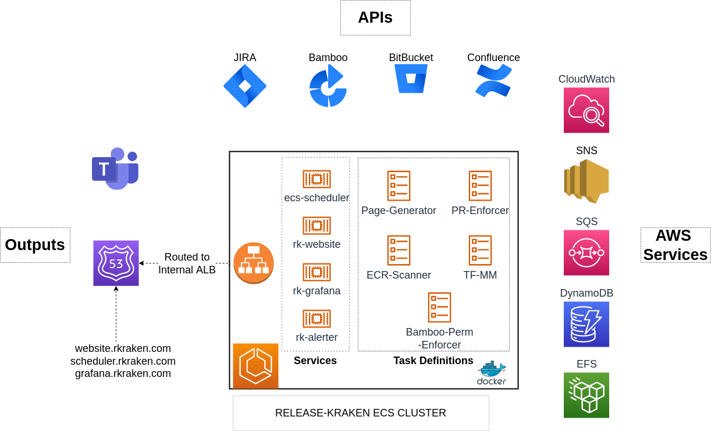
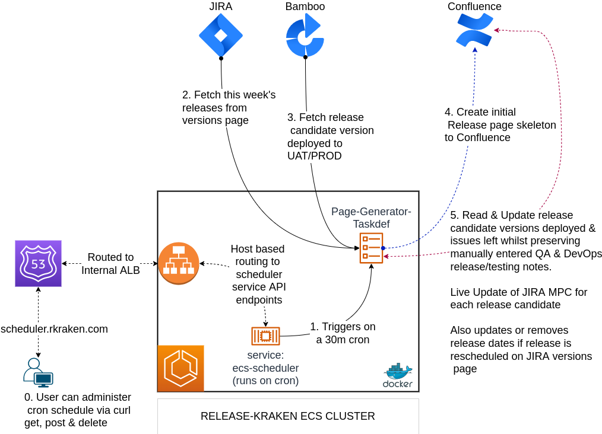
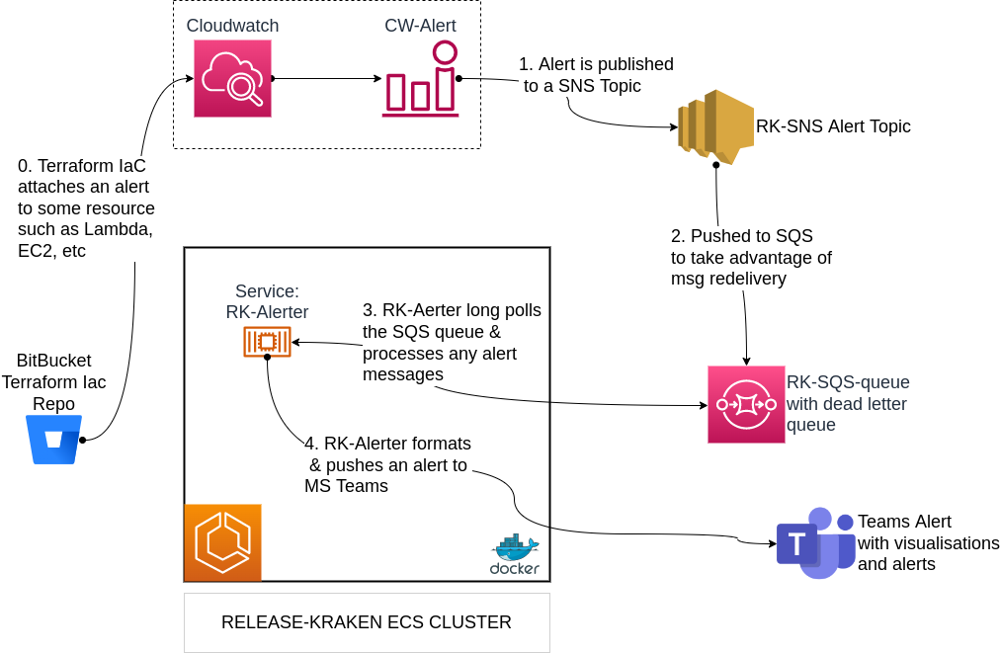
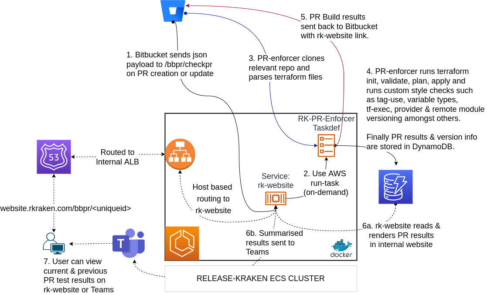
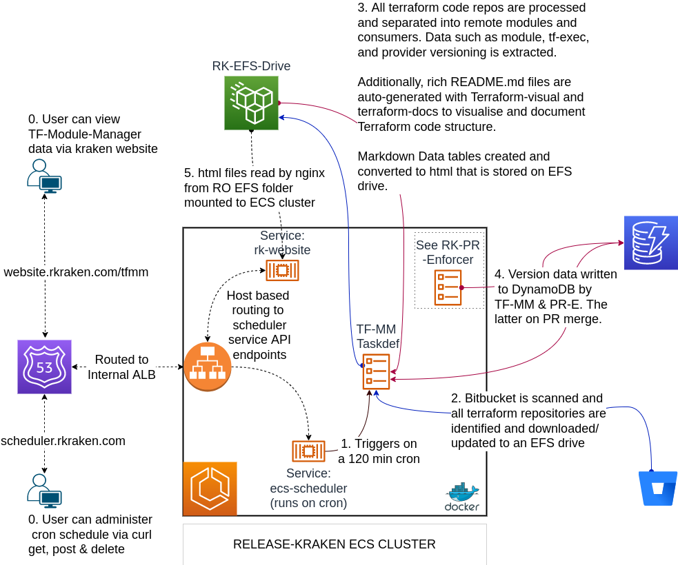
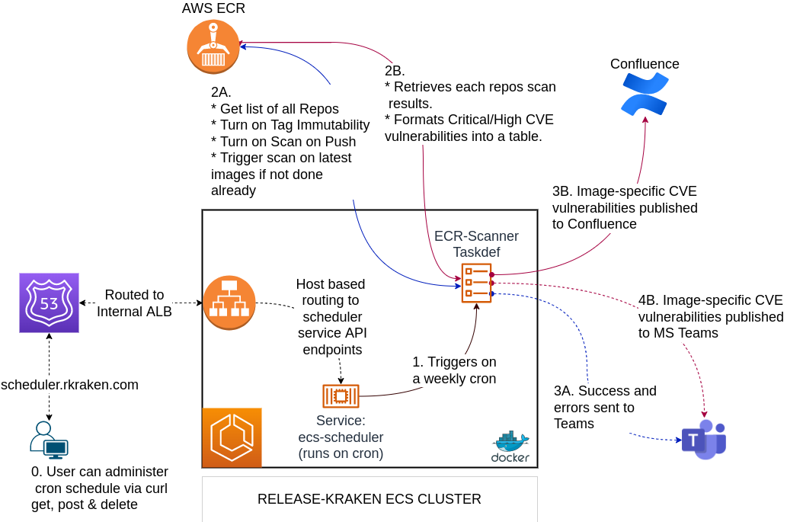
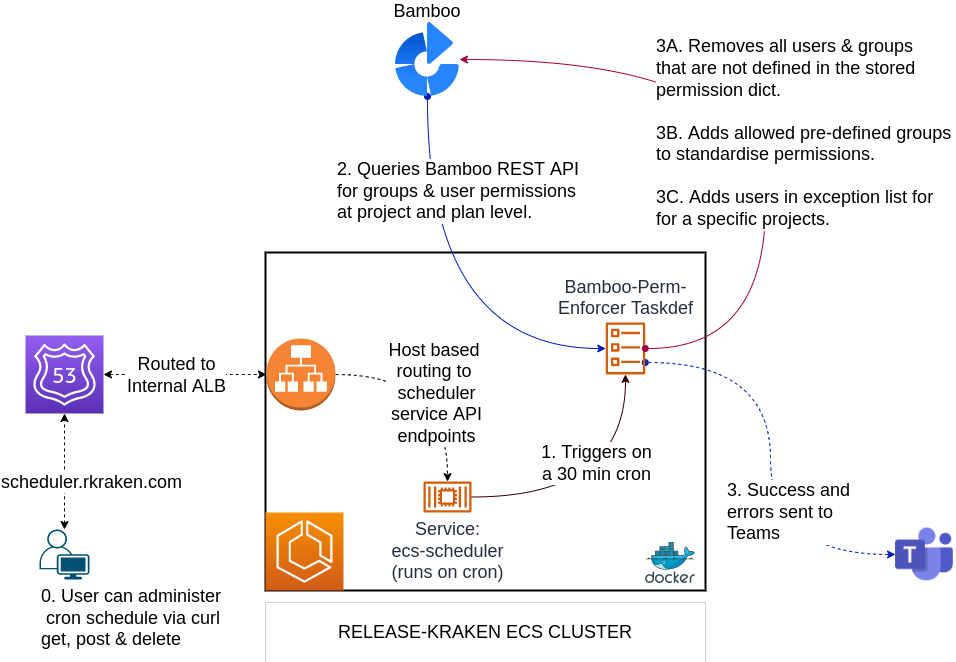
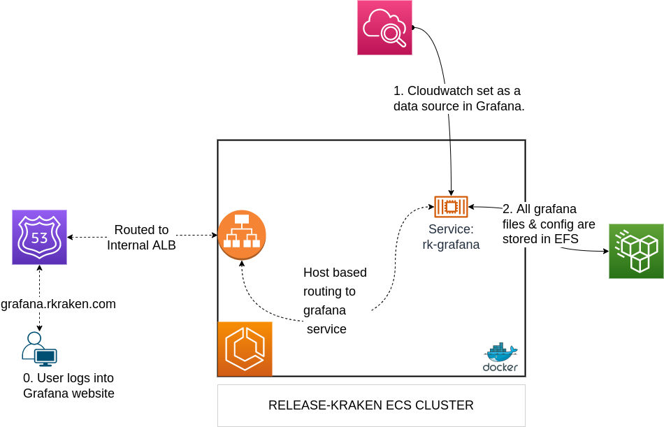

# System Architecture Examples

## Release-Kraken Overview
#### A Centralised Multi-purpose DevOps Suite of Tools for Automation & Monitoring

The release-kraken suite of tools was developed for a variety of different tasks and is used internally to improve IaC and the release process. Dockerised code is deployed to ECS to run as long running services or 'run-once' tasks. All code is deployed using Terraform.

---
### RK-Release-Page-Generator

The company releases multiple new software versions from different Dev teams every Saturday. This app generates a rich release page table in confluence by making API calls to JIRA, Bamboo and Confluence. Whilst this is an ostensibly simple application, it possesses additional features that made it indispensable for all the teams that help with the release process. i.e. Developers, DevOps, Support, QA and Management.

1. The app auto-updates the release table every 30 minutes, but preserves manually made Confluence edits in certain columns such as:
    * QA Testing & Deploy notes - preserves text and rich media elements such as embedded pictures.
    * CCB Production Change tickets: place for JIRA ticket that details what the change is. After the change is completed, the Confluence preview of the ticket is struck-through to indicate completion.
    * Attached database sql files, etc.
2. Showed number of Dev tickets left to complete in release (6/12). (So we know if the release will make it prior to Thurs 1300 CCB release cut-off)
3. Displays the app version currently deployed to UAT and PROD. If the planned release version has not been released into UAT, by the Thurs 1300 cut-off, the release date will have to be postponed.
4. Displays release notes generated from Jira release version description
5. Remembers and fills in which group is responsible for deploying the app. Usually Support or DevOps.
6. Failures logged to MS Teams

---
### RK-Cloudwatch-Alerter

I created a Terraform remote module that has a variety of alert types configured. e.g.

1. Lambda - error rate %
2. Duration
3. Memory
4. API Gateway 4xx/5xx
5. ECS Cluster (Memory & CPU)

Various Terraform consumers can feed in the names of resources they created into the remote module so that alerts would be (re)provisioned for that resource every time it was (re)deployed.

I also created an alert client (listens to SQS) that could send alerts to any arbitrary MS Teams channel with a graph depicting the error that triggered the alert via the `GetMetricWidgetImage` API.

---
### RK-Terraform-PR-Enforcer

Tests PR merges for errors:
1. Checks all code entry points in repo (not just the modified state files) by running terraform init, validate and plan.
2. Enforces minimum provider version. e.g. AWS provider must be > 4.0.0
3. Enforces minimum terraform exe version. e.g. terraform binary must be > 1.0.0
4. Checks all variables have types and types.
5. Runs terraform fmt
6. Ensures README.md files are created using terraform-docs
7. Ensure consumers are using s3 backed remote state
8. Ensures remote modules, terraform exe and aws providers are pinned to the correct semantic version.
9. Can be easily extended to run other static analysis tools such as tflint, checkov 2.0, etc

---
### RK-Terraform-Module-Manger

This application provides a management view on the state of multiple remote modules, consumers and their environments. Viewers can view data via the RK-Kraken website. It gives a global overview on:

1. All terraform remote modules and the versions available.
2. Consumer versioning
    * Terraform exec version
    * Provider version
    * All remote modules used by consumer and their versions
3. Visualisation of terraform code structure via [Terraform Visual](https://github.com/hieven/terraform-visual)

Data gathered is organised into tables and an alerts section, highlights issues that should be resolved sooner rather than later. This is useful because it allows DevOps to easily spot configuration drift and to ascertain when an infrastructure repository needs updating. Additionally, the creation of rich readme's enable people who are new to a code base get up to speed quickly.

Note that tables in the DynamoDB database are also updated by RK-Terraform-PR-Enforcer after a PR is merged into master.

---
### RK-ECR-Security-Scanner

This app was written to highlight potential security issues with developer written Dockerfiles. It accomplished the following:

1. Switch on 'immutable tags' on misconfigured ECR repos.
2. Switch on 'scan on push' on misconfigured ECR repos.
3. Run a weekly security scan check and publish Critical/High CVE scan results to MS Teams and Confluence.

If this visibility were not provided, it would be likely that app container versions would not be updated and vital security patches would remain unapplied.

---
### RK-Bamboo-Permission-Enforcer

To facilitate permission management of the on-prem Bamboo server, this python3 app leverages the Bamboo REST API to prevent permission drift and the associated security issues. It does this by:
1. enforcing the use of pre-defined groups such as:
    * developers
    * support
    * design
    * ext-contractors
    * etc
2. Any manually added users and groups were stripped from the permissions unless they were in an exception list. This is definable at the project/plan level.
3. Success/failure sent to MS Teams.

---
### RK-Grafana-visualiser

This service provides Grafana with AWS Cloudwatch as a data source. It is useful because specific AWS IAM permissions do not need to be created or maintained. The dashboards that can be created are much nicer than the ones CloudWatch provides and the service can also be across multiple AWS accounts. All configuration is stored on an EFS drive so the Grafana client can be easily upgraded with minimal data loss risk.

